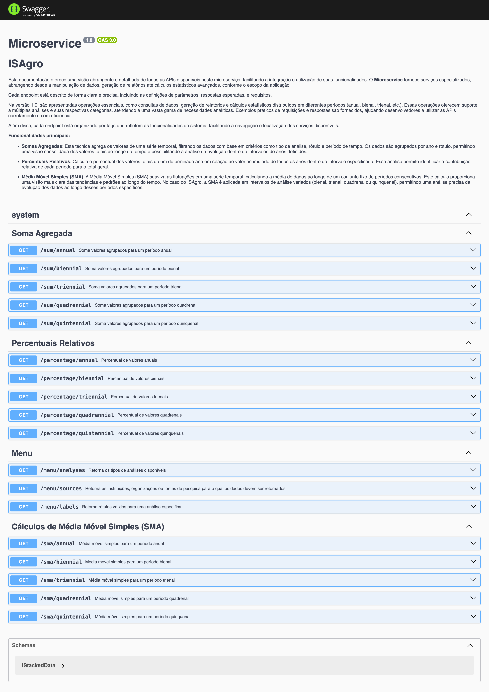
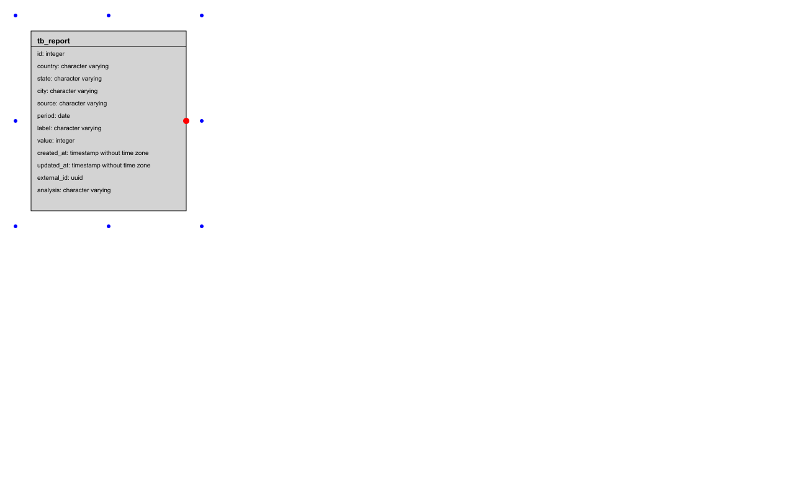

# Repositório do micro-serviço isagro-indicadores-api

## isagro-indicadores-api Database

Este documento descreve a estrutura do banco de dados e os passos para sua criação, incluindo a definição das tabelas, colunas, comentários, funções e triggers. A motivação para a criação deste documento é fornecer um guia detalhado para a configuração do banco de dados, garantindo que todas as etapas sejam seguidas corretamente para uma implementação consistente. Este documento também explica as vantagens de utilizar colunas como `external_id`, funções e triggers diretamente no banco de dados, comparado com a implementação no backend.

### Vantagens das Abordagens

**external_id**:
- Garantia de unicidade: Utilizar `external_id` como identificador único externo garante que cada registro possa ser identificado de forma única, mesmo em sistemas distribuídos.
- Facilidade de integração: `external_id` facilita a integração com outros sistemas e serviços que exigem identificadores únicos que não mudam.

**Funções e Triggers**:
- Consistência dos dados: Triggers garantem que certas regras de negócios sejam aplicadas consistentemente em todo o banco de dados.
- Redução de lógica no backend: Ao mover a lógica de verificação e restrições para o banco de dados, reduz-se a complexidade do código no backend.
- Melhoria da performance: Operações críticas podem ser otimizadas diretamente no banco de dados, evitando a necessidade de múltiplas consultas e verificações no backend.

### Dicionário de Dados

### Diagrama

## Tabela `public.tb_report`

Tabela que armazena informações sobre report.

### Estrutura da Tabela

| Coluna | Tipo | Nulo | Comentário |
|---|---|---|---|
| id | serial4 | NÃO | - |
| country | varchar | NÃO | Código do país no formato ISO 3166-1 alfa-2. Exemplo: BR para Brasil. |
| state | varchar | NÃO | Código do estado no formato ISO 3166-2. Exemplo: RJ para Rio de Janeiro. |
| city | varchar | NÃO | Nome da cidade relacionada ao registro. |
| source | varchar | NÃO | Fonte de pesquisa ou instituição que forneceu os dados. Pode incluir fontes como OCDE, IAC, UNB, entre outras. |
| period | date | NÃO | Data referente ao período em que os dados foram registrados. |
| label | varchar | NÃO | Rótulo que descreve o item pesquisado, como fertilizantes, cultura, etc. |
| value | serial4 | NÃO | Valor numérico associado ao rótulo, representando a quantidade ou medida específica. |
| created_at | timestamp | NÃO | Data de criação do registro. |
| updated_at | timestamp | SIM | Data de atualização do registro. |
| external_id | uuid | NÃO | Identificador único externo de registros desta tabela. Este campo é obrigatório. |
| analysis | varchar | NÃO | Tipo de análise referente ao registro, como erosão, GEE, NH3, NPK, orgânicas, pesticidas ou poluição. |

### Comentários das Colunas

- **id**: Sem comentário.
- **country**: Código do país no formato ISO 3166-1 alfa-2. Exemplo: BR para Brasil.
- **state**: Código do estado no formato ISO 3166-2. Exemplo: RJ para Rio de Janeiro.
- **city**: Nome da cidade relacionada ao registro.
- **source**: Fonte de pesquisa ou instituição que forneceu os dados. Pode incluir fontes como OCDE, IAC, UNB, entre outras.
- **period**: Data referente ao período em que os dados foram registrados.
- **label**: Rótulo que descreve o item pesquisado, como fertilizantes, cultura, etc.
- **value**: Valor numérico associado ao rótulo, representando a quantidade ou medida específica.
- **created_at**: Data de criação do registro.
- **updated_at**: Data de atualização do registro.
- **external_id**: Identificador único externo de registros desta tabela. Este campo é obrigatório.
- **analysis**: Tipo de análise referente ao registro, como erosão, GEE, NH3, NPK, orgânicas, pesticidas ou poluição.
